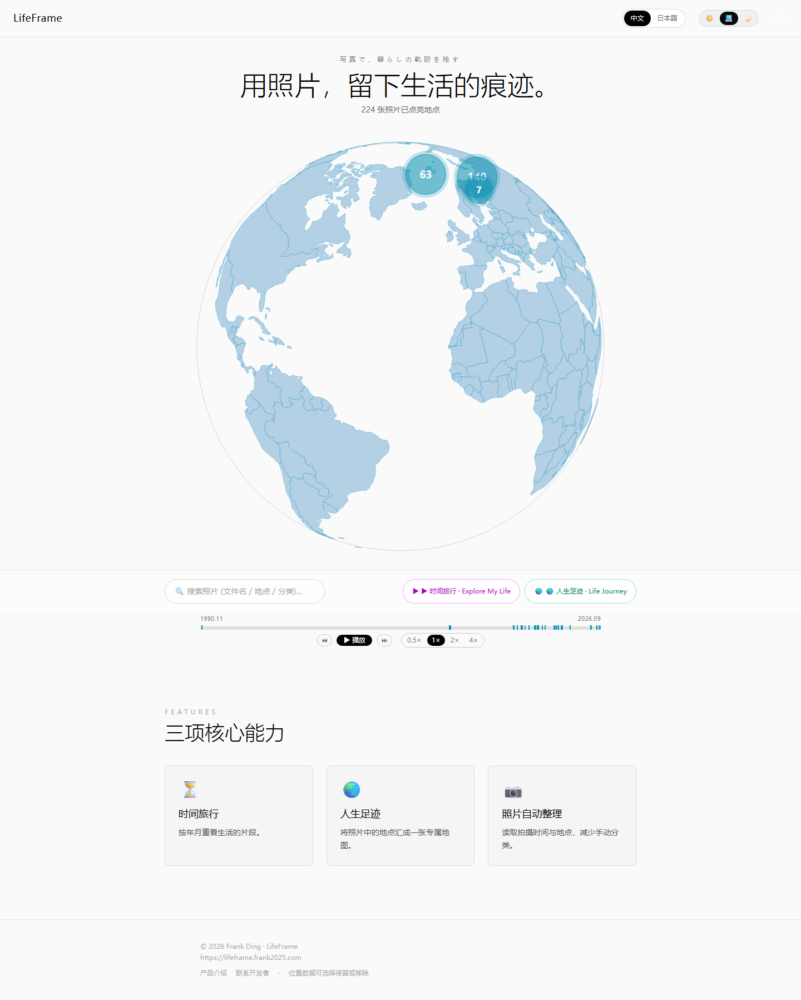
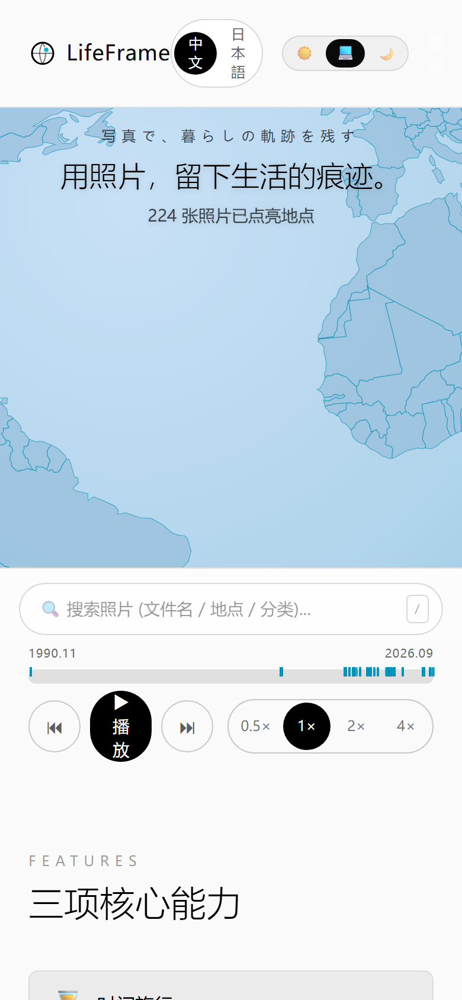

# LifeFrame

> 用照片，留下生活的痕迹。
> 写真で、暮らしの軌跡を残す。

**LifeFrame 是一张私人照片地图** —— 把照片按「时间 × 空间」重新组织成一颗可探索的 3D 地球。上传照片后自动读取拍摄时间与 GPS，点亮地球上的位置点；沿着时间轴拖动，就能像播放器一样回放走过的地方、见过的人、看过的风景。

线上地址：<https://lifeframe.frank2025.com>




---

## 核心功能

### 🌍 3D 地球仪（首页）
- **d3-geo 手绘地球**：SVG 大陆 + 海洋，缓慢自动旋转
- 照片按 GPS 投射成地球上的**标记点**；同位置多张照片聚合为**集群徽章**，点击展开
- 交互：
  - 拖拽旋转（支持 2 指捏合缩放手势，pinch 后单指仍可继续旋转）
  - 滚轮 / 双指缩放，放大到接近城市尺度
  - 悬停标记弹出照片缩略图

### ⏳ 时间轴（首页底部）
- 一条从 **1990.11 到「现在」** 的进度条，每张照片是一个章节刻度
- 拖动游标按 **±15 天窗口** 过滤地球上的照片标记
- **播放器式控制**：⏮ ▶ ⏭ + 倍速（0.5× / 1× / 2× / 4×），自动沿时间线播放；空格键播放/暂停
- 桌面端悬停显示日期提示，拖动时显示 ±窗口内照片缩略图

### 🔍 搜索（桌面 + 移动端）
- 按 **文件名 / 地点 / 分类** 实时过滤
- 输入即显示**匹配计数**与**缩略图预览下拉**（前 6 张），点击直接打开照片
- 快捷键 `/` 聚焦搜索框

### 📅 On This Day「历史上这一天」
- 展示往年同一天（去年、前年…）拍摄的照片 —— 每年生日 / 纪念日翻一翻

### ▶ 时间旅行 & 🌏 人生足迹
- **时间旅行**：按年月重看生活片段（视频时间线 + 照片回放）
- **人生足迹**：把照片里的地点汇成一张专属地图（城市 / 国家分组浏览）

### 📷 上传与自动整理（/admin/upload，管理员）
- 批量上传（最多 30 张），**自动读取 EXIF** 的拍摄时间、GPS、相机型号
- 默认**清除原图 GPS**（隐私保护）；可选「保留原图 EXIF GPS 坐标」
- 自动生成 **256×256 WebP 缩略图**
- 多标签分类（人物 / 风景…），上传后可随时重新整理
- 无 GPS 的老照片可手动选地点（地图选点 / 使用当前位置）

### 🖼️ PhotoViewer 照片查看器
- 全屏照片浏览，键盘 ← → / 点击翻页，相邻照片预加载
- 慢网自动出现「重试」；支持点赞、评论
- **可见性控制**：`private`（仅自己）/ `unlisted`（有链接可看）/ `public`（公开可索引）

### 其他
- 独立浏览页：[/timeline](./app/timeline/page.tsx) 按月浏览、[/stats](./app/stats/page.tsx) 足迹统计（国家/城市）、[/photos/[id]](./app/photos) 照片分享落地页
- **中 / 日双语**（站内一键切换），暗色 / 浅色 / 跟随系统主题
- **PWA**：可安装（standalone）、manifest + 图标
- 新访客欢迎横幅 + 登录后 3 步引导（OnboardingFlow）

---

## 页面地图

| 路由 | 说明 | 访问 |
| --- | --- | --- |
| `/` | 首页：3D 地球 + 时间轴 + 搜索 | 公开（未登录可看公开风景照） |
| `/welcome` | 产品介绍页（营销/SEO） | 公开 |
| `/login` | 邮箱 + 密码登录/注册 | 公开 |
| `/admin/upload` | 上传照片（批量 + EXIF） | 管理员 |
| `/admin/photos` | 照片管理（编辑地点 / 标签 / 可见性 / 删除） | 管理员 |
| `/photos/[id]` | 单张照片分享页（public/unlisted） | 视可见性 |
| `/timeline` | 按月浏览照片 | 公开风景照 |
| `/stats` | 足迹统计（国家 / 城市） | 公开 |
| `/upload` | 旧入口，302 → `/admin/upload` | 重定向 |

---

## 技术栈

| 层 | 选型 |
| --- | --- |
| 框架 | Next.js 15（App Router）+ React 19 + TypeScript |
| 样式 | Tailwind CSS v4 |
| 地球 | **d3-geo** + topojson（world-atlas 国家数据），纯 SVG 渲染 |
| 地图选点 | MapLibre GL + OpenFreeMap 瓦片 |
| Auth / 数据库 | Supabase（Auth + Postgres，RLS 权限控制） |
| 对象存储 | Cloudflare R2（签名 URL 直传，不经应用服务器） |
| 图片处理 | sharp（缩略图）+ piexifjs（EXIF GPS 剥离）|
| EXIF 读取 | exifr（浏览器端读 takenAt / GPS / Make / Model） |
| i18n | 轻量自研字典（zh-Hans / ja），Cookie 持久化 |
| 测试 | Playwright（E2E：转场 / 手势 / viewer / 响应式脚本见 `scripts/`） |

---

## 上传数据链路

```
选择图片 → 浏览器 exifr 读 EXIF
        → 可选剥离 GPS (piexifjs)
        → POST /api/upload-url 拿 R2 签名 URL
        → 直传 R2（不经应用服务器）
        → 写一行到 Supabase photos 表
        → /api/process-thumbnail 生成 256×256 WebP 缩略图
        → 首页 Globe / 时间轴 / 搜索自动出现
```

照片**默认私密**：首页只对访客展示 RLS 过滤后的 public 风景照；登录用户看到自己的全部照片；`/admin/*` 由 middleware + 服务端双重管理员校验。

---

## 起步

### 1. 环境变量

复制 `.env.example` 为 `.env.local` 并填写：

```
# Cloudflare R2（对象存储）
R2_ACCOUNT_ID=
R2_ACCESS_KEY_ID=
R2_SECRET_ACCESS_KEY=
R2_BUCKET=
R2_PUBLIC_BASE=https://pub-xxxxxxxxxxxx.r2.dev

# Supabase（Auth + Postgres）
NEXT_PUBLIC_SUPABASE_URL=
NEXT_PUBLIC_SUPABASE_ANON_KEY=
SUPABASE_SERVICE_ROLE_KEY=
```

参考 Supabase 建表 SQL（photos / comments / likes…）与 RLS 策略 —— 见项目历史 `infra/` 迁移说明（categories、location_name、thumbnail 等列）。

### 2. 安装并运行

```bash
npm install
npm run dev        # http://localhost:3000
```

生产模式（本仓库测试都用生产构建，避免 dev HMR 干扰）：

```bash
npm run build && npm run start
```

### 3. 类型检查与测试

```bash
npm run typecheck
node scripts/test-touch-gesture.mjs      # 移动端 Globe 手势（pinch/rotate）
node scripts/test-photo-viewer.mjs       # PhotoViewer 翻页 / 键盘 / 预加载
node scripts/test-viewer-responsive.mjs  # viewer 响应式
```

---

## 部署

- **Vercel**（生产，GitHub 集成自动部署 `main` 分支）
- 在 Vercel 项目环境变量里配置上述 R2 + Supabase 变量
- 域名：`lifeframe.frank2025.com`

---

## 目录结构

```
app/
  page.tsx                首页（Hero Globe + Search + Timeline 宿主）
  layout.tsx              全局 layout：Header / i18n / 主题 / Onboarding / PWA
  welcome/page.tsx        产品介绍页
  login/page.tsx          登录/注册
  admin/upload/page.tsx   上传页（管理员）
  admin/photos/page.tsx   照片管理
  admin/page.tsx          管理后台
  photos/[id]/page.tsx    照片分享落地页
  timeline/page.tsx       按月浏览
  stats/page.tsx          足迹统计
  api/                    upload-url / process-thumbnail / photos 评论/点赞/可见性等
components/
  Globe.tsx               d3-geo 3D 地球（拖拽/缩放/pinch + 标记集群）
  HomeGallery.tsx         首页编排：Globe + 时间轴 + 搜索 + 弹层
  Timeline.tsx            时间轴（播放/倍速/±15天窗口）
  TimeTravel.tsx          时间旅行弹层
  LifeJourney.tsx         人生足迹弹层
  SearchBox.tsx           搜索框（计数 + 缩略图下拉）
  PhotoViewer.tsx         全屏照片查看器
  FeaturesGrid.tsx        首页功能演示卡（SVG demo）
  OnboardingFlow.tsx      登录后 3 步引导
  WelcomeBanner.tsx       访客欢迎横幅
  LifeFrameLogo.tsx / HomeLogo.tsx    Logo
  SiteFooter.tsx          统一页脚
  ThemeToggle.tsx / LanguageSwitcher.tsx / PWARegistrar.tsx ...
lib/
  supabase.ts             类型 + 服务端客户端
  supabase-browser.ts / supabase-server.ts
  permissions.ts          Viewer / 可见性 / 管理员判断
  r2.ts                   R2 签名 URL
  exif.ts / exif-strip.ts EXIF 读取与 GPS 剥离
  photo-url.ts            图片 URL 解析
  i18n.ts / i18n-server.ts 双语字典 + Cookie locale
  countries.ts            world-atlas 国家地理数据
scripts/                  Playwright 测试脚本
screenshots/              开发过程中的验证截图
```

---

## 作者

Frank Ding —— 个人项目。意见 / 建议：<dingfeng901112@gmail.com>
